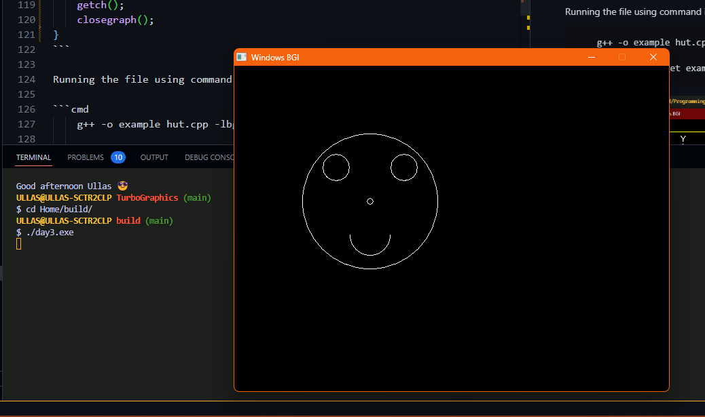

## Setting up graphics library (graphics.h) in Visual Studio Code (c++)

### Table Of Content

- [General info](#general-info)
- [files](#files)
- [Setup](#setup)
- [.vscode config file](https://github.com/kumarbaberval/Solution-to-graphics.h/tree/main/.vscode)

My Workspace Dir and code example


## General information

It like a tradition to use Turbo in our Indian CS sector.
Its because the syllabus haven't been changed since long time.

The graphics. h header file provides access to a simple graphics library that makes it possible to draw lines, rectangles, ovals, arcs, polygons, images, and strings on a graphical window. The second step is initialize the graphics drivers on the computer using initgraph method of graphics. h library.

- To know More [Stanford](https://web.stanford.edu/class/archive/cs/cs106b/cs106b.1126/materials/cppdoc/graphics.html) !!old

`<graphics.h> is very old library. It's better to use something that is new.`

Trust Me **There are much better option**

Allegro or SDL libraries may be for you.
You could also try SFML. It has quite a following. You'll have a large community behind you if you needed any help.

--------------------------------------------------

## files

- [Graphics](./graphics.h)
- [Winbgim](./winbgim.h)
- [libbgi](./libbgi.a)

## Setup


UPDATE:
switching from `MinGW` to `TDM-GCC-32`

Install `TDM-GCC-32` from their [official site link](https://jmeubank.github.io/tdm-gcc/)

|||
|--|--|

- after that default step that's all

## Get all the files needed `graphics.h`, `winbgim.h` and `libbgi.a`

- Copy `graphics.h` and `winbgim.h` files to `TDM-GCC-32/include` folder.

location might be **("C:/TDM-GCC-32/include/")**

- Copy `libbgi.a` to file to `TDM-GCC-32/lib` folder.

location might be **("C:/TDM-GCC-32/lib")**

Open Vs Code Smart way:

- Select a folder and open Terminal

```bash
   mkdir cppGraphics
   cd cppGraphics
   code .
```

if you are using template with task and c_cpp_properties json file then you directory should look like this:

- All your code should be inside `src` and the task.json will build the .exe in `build` folder

```cmd
cppGraphics
├───.vscode
└───Home
    ├───build
    └───src
```

- `.vscode` folder in that workspace which will contain `task.json`, `c_cpp_properties.json`


```cpp
//create a file name it example.cpp inside src or any other name with .cpp extension

#include <graphics.h>

int main(){
    int gdrive = DETECT;
    int gmode;

    initgraph(&gdrive, &gmode, NULL);
    // you can also pass NULL for third parameter if you did above setup successfully
    // example: initgraph(&gd, &gm, NULL);

    arc(200, 200, 0, 360, 100);
    arc(150, 150, 0, 360, 20);
    arc(250, 150, 0, 360, 20);

    arc(200, 200, 0, 360, 5);
    arc(200, 250, 180, 360, 30);

    getch();
    closegraph();
}
```

### Just `Ctrl+Shift+B` to run the build task you will get the executable file in build folder




## Manual

Running the file using command in termainl:

```cmd
    g++ -o example day3.cpp -lbgi -lgdi32 -lcomdlg32 -luuid -loleaut32 -lole32

    //after u'll get example.exe run using command: .\example
```

---

Now To set up graphics.h in vs code using MINGW:

alternative video instruction in `hindi` to setup graphics.h lib in vscode

[]([https://www.youtube.com/embed/ijrNSHwXDAc "How to setup graphic.h library in Visual Studio Code | Computer Graphics in VS Code | CGMA](https://www.youtube.com/watch?v=QMom7QbX7IM&t=363s)" )

 Alternative step wise instruction to setup MinGW along with graphics library (graphics.h)


